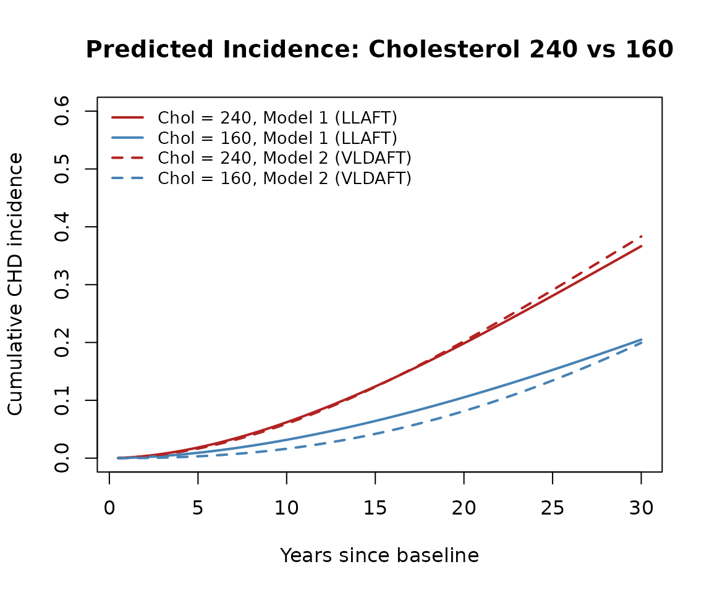

# Reproducing Anderson (1991): A Nonproportional Hazards Weibull AFT Model

## Introduction

Anderson (1991) introduced the varying location and dispersion
accelerated failure time (VLDAFT) model, in which both the location
$\mu$ and the dispersion $\sigma$ of a log-linear survival model can
depend on covariates and on each other. This vignette reproduces the
results from the original Biometrics paper using the `vldaft` package.
This is done both with the original C routines to compute the
log-likelihood and score functions, as well as through the `gamlss2`
framework for comparison. Both approaches yield the same results and
replicate the paper. We hope that this demonstration enables further use
of the approach which can simplify modeling. A particular advantage is
on the Weibull distribution, where the VLDAFT model allows for
nonproportional hazards by letting the dispersion depend on the location
parameter.

**Reference:** Anderson, K.M. (1991). A nonproportional hazards Weibull
accelerated failure time regression model. *Biometrics*, **47**,
281–288.

## The Model

The VLDAFT model assumes

$$\Pr\!\left\{ \frac{\log(T) - \mu}{\sigma} < u \right\} = F(u),$$

where $\mu = {\mathbf{β}}\prime\mathbf{X}$ is a linear function of
covariates, and the log-dispersion $\log(\sigma)$ can depend on both
covariates and on $\mu$ itself:

$$\log(\sigma) = \theta_{0} + \theta_{1}\mu^{*}.$$

Here $\mu^{*} = \mu - \bar{\mu}$ is the centered location parameter.
When $\theta_{1} = 0$, this reduces to the standard linear location AFT
(LLAFT) model with proportional hazards under a Weibull distribution.

## Data

The example uses 1,433 men aged 30–49 from the Framingham Heart Study,
followed for approximately 32 years for coronary heart disease (CHD)
incidence. Risk factors were measured at baseline.

``` r
cat("Observations:", info$observations, "\n")
#> Observations: 1433
cat("CHD events:", info$chd_events, "\n")
#> CHD events: 501
cat("Censored:", info$censored, "\n")
#> Censored: 932
```

The covariates are log(Age), log(systolic blood pressure),
log(cholesterol), Metropolitan relative weight, and a smoking indicator.

``` r
print(info$covariate_summary)
#>     ln.Age.         ln.SBP.         ln.Chol.          MRW       
#>  Min.   :3.401   Min.   :4.382   Min.   :4.745   Min.   : 78.0  
#>  1st Qu.:3.584   1st Qu.:4.771   1st Qu.:5.288   1st Qu.:108.0  
#>  Median :3.689   Median :4.852   Median :5.398   Median :118.0  
#>  Mean   :3.694   Mean   :4.858   Mean   :5.398   Mean   :119.2  
#>  3rd Qu.:3.807   3rd Qu.:4.942   3rd Qu.:5.509   3rd Qu.:130.0  
#>  Max.   :3.892   Max.   :5.521   Max.   :6.342   Max.   :183.0  
#>      Smoke       
#>  Min.   :0.0000  
#>  1st Qu.:0.0000  
#>  Median :1.0000  
#>  Mean   :0.6971  
#>  3rd Qu.:1.0000  
#>  Max.   :1.0000
```

## Model Fitting

Anderson (1991) reported four Weibull models of increasing complexity.
We reproduce all four.

### Model 1: Standard LLAFT (proportional hazards Weibull)

$$\mu = {\mathbf{β}}\prime\mathbf{X},\quad\log(\sigma) = \theta_{0}$$

``` r
fit1 <- vldaft(Surv(YTCHD, CHD) ~ ln.Age. + ln.SBP. + ln.Chol. + MRW + Smoke,
               data = MLT50, dist = "weibull", theta = 0)
```

``` r
cat(paste(summaries$fit1, collapse = "\n"), "\n")
#> AFT Regression Model (Anderson 1991)
#> 
#> Call:
#> vldaft(formula = Surv(YTCHD, CHD) ~ ln.Age. + ln.SBP. + ln.Chol. + 
#>     MRW + Smoke, data = MLT50, dist = "weibull", theta = 0)
#> 
#> Distribution: weibull 
#> Observations: 1433 
#> Log-likelihood: -1104.69  (init: -35508.1 )
#> Score statistic: -1 
#> Iterations: 14 
#> 
#> Coefficients:
#>                     Estimate Std. Error  z value  Pr(>|z|)    
#> gamma:(Intercept) -0.5804654  0.0401405 -14.4608 < 2.2e-16 ***
#> eta:(Intercept)    3.9189608  0.0340533 115.0832 < 2.2e-16 ***
#> eta:ln.Age.       -1.2221808  0.2162649  -5.6513 1.592e-08 ***
#> eta:ln.SBP.       -0.9485825  0.2070646  -4.5811 4.625e-06 ***
#> eta:ln.Chol.      -0.9503949  0.1415783  -6.7129 1.908e-11 ***
#> eta:MRW           -0.0046964  0.0016137  -2.9102 0.0036114 ** 
#> eta:Smoke         -0.1989825  0.0565299  -3.5199 0.0004316 ***
#> ---
#> Signif. codes:  0 ‘***’ 0.001 ‘**’ 0.01 ‘*’ 0.05 ‘.’ 0.1 ‘ ’ 1
```

Since Model 1 is a standard Weibull AFT, we can cross-check against
[`survival::survreg`](https://rdrr.io/pkg/survival/man/survreg.html):

``` r
fit_survreg <- survreg(
  Surv(YTCHD, CHD) ~ ln.Age. + ln.SBP. + ln.Chol. + MRW + Smoke,
  data = MLT50, dist = "weibull")
```

``` r
print(checks$coef_compare, digits = 7)
#>                  survreg       vldaft    difference
#> (Intercept) 18.869878310 18.869878192  1.184292e-07
#> ln.Age.     -1.222180634 -1.222180769  1.350743e-07
#> ln.SBP.     -0.948582322 -0.948582481  1.582619e-07
#> ln.Chol.    -0.950395178 -0.950394935 -2.432144e-07
#> MRW         -0.004696388 -0.004696388 -1.468580e-10
#> Smoke       -0.198982499 -0.198982501  2.195279e-09
```

``` r
# Compare scale parameter
cat("survreg scale (sigma):", checks$survreg_sigma, "\n")
#> survreg scale (sigma): 0.5596379
cat("vldaft  scale (sigma):", checks$vldaft_sigma, "\n")
#> vldaft  scale (sigma): 0.5596379
```

The coefficients and scale parameter agree, confirming the `vldaft`
implementation for the standard model.

### Model 2: VLDAFT with dispersion depending on location

$$\mu = {\mathbf{β}}\prime\mathbf{X},\quad\log(\sigma) = \theta_{0} + \theta_{1}\mu^{*}$$

``` r
fit2 <- vldaft(Surv(YTCHD, CHD) ~ ln.Age. + ln.SBP. + ln.Chol. + MRW + Smoke,
               data = MLT50, dist = "weibull", theta = 1)
```

``` r
cat(paste(summaries$fit2, collapse = "\n"), "\n")
#> AFT Regression Model (Anderson 1991)
#> 
#> Call:
#> vldaft(formula = Surv(YTCHD, CHD) ~ ln.Age. + ln.SBP. + ln.Chol. + 
#>     MRW + Smoke, data = MLT50, dist = "weibull", theta = 1)
#> 
#> Distribution: weibull 
#> Observations: 1433 
#> Log-likelihood: -1094.24  (init: -35508.1 )
#> Score statistic: -1 
#> Iterations: 14 
#> 
#> Coefficients:
#>                     Estimate Std. Error  z value  Pr(>|z|)    
#> gamma:(Intercept)  2.9778006  1.3457787   2.2127 0.0269185 *  
#> eta:(Intercept)    3.8385302  0.0321886 119.2511 < 2.2e-16 ***
#> eta:ln.Age.       -0.7417504  0.1770810  -4.1888 2.805e-05 ***
#> eta:ln.SBP.       -0.6579658  0.1730218  -3.8028 0.0001431 ***
#> eta:ln.Chol.      -0.6071953  0.1341263  -4.5270 5.982e-06 ***
#> eta:MRW           -0.0026011  0.0011570  -2.2481 0.0245711 *  
#> eta:Smoke         -0.1594967  0.0389560  -4.0943 4.235e-05 ***
#> theta1            -0.9525121  0.3585544  -2.6565 0.0078948 ** 
#> ---
#> Signif. codes:  0 ‘***’ 0.001 ‘**’ 0.01 ‘*’ 0.05 ‘.’ 0.1 ‘ ’ 1
```

### Model 3a: Quadratic theta

$$\mu = {\mathbf{β}}\prime\mathbf{X},\quad\log(\sigma) = \theta_{0} + \theta_{1}\mu^{*} + \theta_{2}{\mu^{*}}^{2}$$

As noted in the paper, convergence from zero starting values can be
difficult for more complex models. We use Model 2 estimates as starting
values, appending zero for the new $\theta_{2}$ parameter.

``` r
init3a <- c(fit2$coefficients, 0)
fit3a <- vldaft(Surv(YTCHD, CHD) ~ ln.Age. + ln.SBP. + ln.Chol. + MRW + Smoke,
                data = MLT50, dist = "weibull", theta = 2, init = init3a)
```

``` r
cat(paste(summaries$fit3a, collapse = "\n"), "\n")
#> AFT Regression Model (Anderson 1991)
#> 
#> Call:
#> vldaft(formula = Surv(YTCHD, CHD) ~ ln.Age. + ln.SBP. + ln.Chol. + 
#>     MRW + Smoke, data = MLT50, dist = "weibull", theta = 2, init = init3a)
#> 
#> Distribution: weibull 
#> Observations: 1433 
#> Log-likelihood: -1094.2  (init: -1094.24 )
#> Score statistic: 0.289811 
#> Iterations: 4 
#> 
#> Coefficients:
#>                     Estimate Std. Error  z value  Pr(>|z|)    
#> gamma:(Intercept)  0.5870780  8.1632058   0.0719 0.9426675    
#> eta:(Intercept)    3.8377582  0.0322726 118.9168 < 2.2e-16 ***
#> eta:ln.Age.       -0.7227241  0.1862179  -3.8811 0.0001040 ***
#> eta:ln.SBP.       -0.6569947  0.1720719  -3.8181 0.0001345 ***
#> eta:ln.Chol.      -0.6017253  0.1353597  -4.4454 8.774e-06 ***
#> eta:MRW           -0.0025126  0.0011802  -2.1290 0.0332502 *  
#> eta:Smoke         -0.1574287  0.0391718  -4.0189 5.846e-05 ***
#> theta1             0.3278279  4.3631493   0.0751 0.9401068    
#> theta2            -0.1709261  0.5854120  -0.2920 0.7703052    
#> ---
#> Signif. codes:  0 ‘***’ 0.001 ‘**’ 0.01 ‘*’ 0.05 ‘.’ 0.1 ‘ ’ 1
```

### Model 3b: Full scale model

$$\mu = {\mathbf{β}}\prime\mathbf{X},\quad\log(\sigma) = {\mathbf{γ}}\prime\mathbf{X}$$

Here both location and scale have separate linear predictors with the
full set of covariates. The `|` operator in the formula separates
location (left) from scale (right) covariates.

``` r
fit3b <- vldaft(
  Surv(YTCHD, CHD) ~ ln.Age. + ln.SBP. + ln.Chol. + MRW + Smoke |
                      ln.Age. + ln.SBP. + ln.Chol. + MRW + Smoke,
  data = MLT50, dist = "weibull", theta = 0)
```

``` r
cat(paste(summaries$fit3b, collapse = "\n"), "\n")
#> AFT Regression Model (Anderson 1991)
#> 
#> Call:
#> vldaft(formula = Surv(YTCHD, CHD) ~ ln.Age. + ln.SBP. + ln.Chol. + 
#>     MRW + Smoke | ln.Age. + ln.SBP. + ln.Chol. + MRW + Smoke, 
#>     data = MLT50, dist = "weibull", theta = 0)
#> 
#> Distribution: weibull 
#> Observations: 1433 
#> Log-likelihood: -1092.5  (init: -35508.1 )
#> Score statistic: -1 
#> Iterations: 18 
#> 
#> Coefficients:
#>                     Estimate Std. Error  z value  Pr(>|z|)    
#> gamma:(Intercept) -0.6740649  0.0442573 -15.2306 < 2.2e-16 ***
#> gamma:ln.Age.      0.7035408  0.3348376   2.1011 0.0356286 *  
#> gamma:ln.SBP.      0.5379124  0.3174538   1.6945 0.0901782 .  
#> gamma:ln.Chol.     0.4767665  0.2323611   2.0518 0.0401858 *  
#> gamma:MRW          0.0014924  0.0025257   0.5909 0.5545905    
#> gamma:Smoke        0.2940132  0.0912093   3.2235 0.0012663 ** 
#> eta:(Intercept)    3.8446356  0.0330466 116.3399 < 2.2e-16 ***
#> eta:ln.Age.       -0.7525451  0.2549722  -2.9515 0.0031626 ** 
#> eta:ln.SBP.       -0.7599684  0.2354839  -3.2273 0.0012498 ** 
#> eta:ln.Chol.      -0.6658450  0.1720855  -3.8693 0.0001092 ***
#> eta:MRW           -0.0032470  0.0018402  -1.7645 0.0776476 .  
#> eta:Smoke         -0.0688494  0.0619879  -1.1107 0.2667015    
#> ---
#> Signif. codes:  0 ‘***’ 0.001 ‘**’ 0.01 ‘*’ 0.05 ‘.’ 0.1 ‘ ’ 1
```

## Comparison with Published Results

The paper reports log-likelihoods on the time scale, which includes a
Jacobian term $\sum d_{i}\log\left( t_{i} \right)$. We adjust our
log-likelihoods accordingly.

``` r
print(checks$results_table, row.names = FALSE)
#>                 Model   vldaft    Paper Difference
#>             1 (LLAFT) -2510.96 -2510.96          0
#>   2 (VLDAFT, theta=1) -2500.50 -2500.50          0
#>  3a (VLDAFT, theta=2) -2500.46 -2500.46          0
#>       3b (full scale) -2498.76 -2498.76          0
```

### Likelihood Ratio Test: Model 2 vs Model 1

``` r
cat(sprintf("LRT statistic: %.2f  (paper: 20.92)\n", checks$lrt))
#> LRT statistic: 20.91  (paper: 20.92)
cat(sprintf("p-value (chi-sq, 1 df): %.2e\n", checks$lrt_p))
#> p-value (chi-sq, 1 df): 4.83e-06
```

The LLAFT model is strongly rejected in favor of the VLDAFT model
($\chi_{1}^{2} = 20.9$, $p < 0.001$).

### Model 2 Coefficient Comparison

``` r
print(checks$coef_table, row.names = FALSE)
#>           Parameter  vldaft     Paper
#>   beta0 (intercept) 13.4733 13.474000
#>      beta1 (ln Age) -0.7418 -0.741800
#>      beta2 (ln SBP) -0.6580 -0.658000
#>     beta3 (ln Chol) -0.6072 -0.607200
#>         beta4 (MRW) -0.0026 -0.002601
#>       beta5 (Smoke) -0.1595 -0.159500
#>  theta0 (log sigma)  2.9778  2.978000
#>              theta1 -0.9525 -0.952500
```

All coefficients match the published values to their reported precision.

## Fitting with gamlss2

The `vldaft` package provides `gamlss2`-compatible family objects
(`AFT_Weibull`, `AFT_Logistic`, etc.) so that the same models can be
fitted through the `gamlss2` framework. This enables the use of smooth
terms, additional diagnostics, and the full `gamlss2` infrastructure.

We demonstrate by fitting Model 2 (the VLDAFT model with $\theta_{1}$
coupling) via `gamlss2`. In the `gamlss2` formula, the `|` separator
delineates submodels for each parameter: `mu | sigma | theta1`.

``` r
library(gamlss2)

g2 <- gamlss2(
  Surv(YTCHD, CHD) ~ ln.Age. + ln.SBP. + ln.Chol. + MRW + Smoke | 1 | 1,
  data = MLT50, family = AFT_Weibull(theta = 1),
  control = gamlss2_control(maxit = 200))
```

``` r
summary(g2)
```

The `gamlss2` log-likelihood matches the
[`vldaft()`](https://keaven.github.io/vldaft/reference/vldaft.md)
result:

``` r
cat(sprintf("vldaft  loglik: %.3f\ngamlss2 loglik: %.3f\n",
            checks$gamlss2_loglik[["vldaft"]],
            checks$gamlss2_loglik[["gamlss2"]]))
#> vldaft  loglik: -2500.503
#> gamlss2 loglik: -2500.510
```

We can also verify that Models 1, 3a, and 3b agree:

``` r
g1 <- gamlss2(
  Surv(YTCHD, CHD) ~ ln.Age. + ln.SBP. + ln.Chol. + MRW + Smoke,
  data = MLT50, family = AFT_Weibull())

g3a <- gamlss2(
  Surv(YTCHD, CHD) ~ ln.Age. + ln.SBP. + ln.Chol. + MRW + Smoke | 1 | 1 | 1,
  data = MLT50, family = AFT_Weibull(theta = 2),
  control = gamlss2_control(maxit = 200))

g3b <- gamlss2(
  Surv(YTCHD, CHD) ~ ln.Age. + ln.SBP. + ln.Chol. + MRW + Smoke |
                      ln.Age. + ln.SBP. + ln.Chol. + MRW + Smoke,
  data = MLT50, family = AFT_Weibull())
```

``` r
print(checks$gamlss2_check, row.names = FALSE)
#>                 Model   vldaft  gamlss2 Difference
#>             1 (LLAFT) -2510.96 -2510.96       0.00
#>   2 (VLDAFT, theta=1) -2500.50 -2500.51      -0.01
#>  3a (VLDAFT, theta=2) -2500.46 -2500.47      -0.01
#>       3b (full scale) -2498.76 -2498.76       0.00
```

## Interpretation

The significant negative $\theta_{1} = - 0.95$ means that as $\mu$
increases (i.e., as predicted log-survival time increases due to lower
risk), the dispersion $\sigma$ also increases. Equivalently, the
cumulative hazard ratio for two individuals shrinks toward unity over
longer follow-up. This implies:

- Neither the standard Weibull model nor the Cox proportional hazards
  model is adequate for these data.
- The association between risk factors and relative risk diminishes over
  time since measurement—a “converging hazards” phenomenon.

## Predicted Cumulative Incidence

Follow-up in the dataset ranges from less than 1 month to nearly 36
years (median 31 years, interquartile range 19–34 years). We restrict
predictions to 30 years to stay within the well-observed range.

To illustrate the nonproportional hazards effect, we compare predicted
cumulative incidence $F(t) = 1 - S(t)$ for two individuals differing
only in total cholesterol (160 vs 240 mg/dL), with all other covariates
held at their sample means.

Under the Weibull model, $S(t) = \exp\{ - \exp(w)\}$ where
$w = \left( \log t - \mu \right)/\sigma$.

``` r
t_grid <- prediction$t_grid
inc1_240 <- prediction$incidence$model1_chol240
inc1_160 <- prediction$incidence$model1_chol160
inc2_240 <- prediction$incidence$model2_chol240
inc2_160 <- prediction$incidence$model2_chol160
diff1 <- prediction$excess$model1
diff2 <- prediction$excess$model2
```

``` r
plot(t_grid, inc1_240, type = "l",
     col = "firebrick", lwd = 2, lty = 1, ylim = c(0, 0.6),
     xlab = "Years since baseline", ylab = "Cumulative CHD incidence",
     main = "Predicted Incidence: Cholesterol 240 vs 160")
lines(t_grid, inc1_160,
      col = "steelblue", lwd = 2, lty = 1)
lines(t_grid, inc2_240,
      col = "firebrick", lwd = 2, lty = 2)
lines(t_grid, inc2_160,
      col = "steelblue", lwd = 2, lty = 2)
legend("topleft",
       legend = c("Chol = 240, Model 1 (LLAFT)",
                  "Chol = 160, Model 1 (LLAFT)",
                  "Chol = 240, Model 2 (VLDAFT)",
                  "Chol = 160, Model 2 (VLDAFT)"),
       col = c("firebrick", "steelblue", "firebrick", "steelblue"),
       lty = c(1, 1, 2, 2), lwd = 2, bty = "n", cex = 0.85)
```



The difference in cumulative incidence between cholesterol 240 and 160
quantifies how much additional risk the higher cholesterol confers over
time under each model.

``` r
plot(t_grid, diff1, type = "l", lwd = 2, lty = 1,
     col = "black", ylim = c(0, max(diff1, diff2) * 1.1),
     xlab = "Years since baseline",
     ylab = "Difference in cumulative incidence",
     main = "Excess Incidence: Cholesterol 240 vs 160")
lines(t_grid, diff2, lwd = 2, lty = 2, col = "black")
legend("topleft",
       legend = c("Model 1 (LLAFT)", "Model 2 (VLDAFT)"),
       lty = c(1, 2), lwd = 2, bty = "n")
```


Under both models, higher cholesterol is associated with higher
cumulative incidence of CHD over time. The difference in cumulative
incidence also grows over time. The observation that the difference is
always greater with the VLDAFT model reflects the model’s ability to
capture nonproportional hazards.
